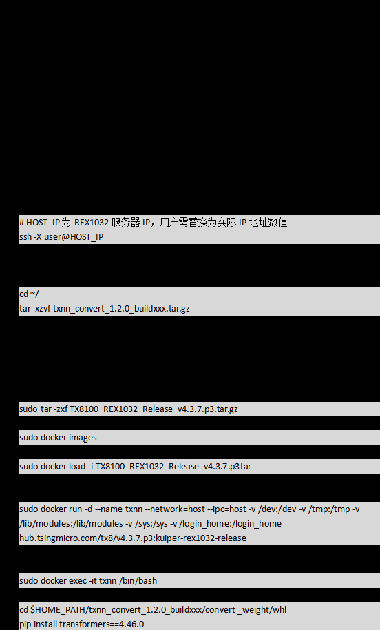

# 模型信息

# 资源准备

# 下载模型代码

git clone https://gitee.com/ascend/ModelZoo-PyTorch.git
权重
下载
环境部署

## 加载镜像

docker load -i mindie:2.0.T3-800I-A2-py311-openeuler24.03-lts-aarch64(下载的镜像名称与标签)
启动容器
进入容器

## 启动Device

## offline推理

## 运行示例

## online推理

- 运行示例

# 版本说明

2025/3/23 第一版

