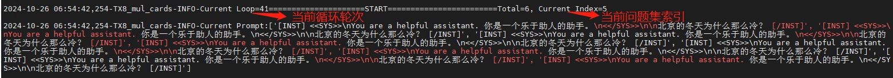
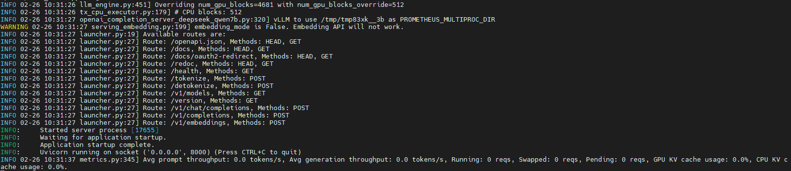
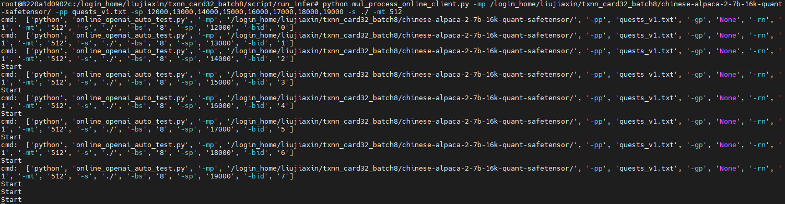
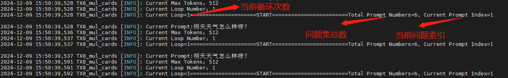

# 模型信息

基于知识蒸馏技术构建的高效语言模型，将DeepSeek-R1的先进推理能力迁移至轻量级Qwen模型，其中DeepSeek-R1-Distill-Qwen-7B是其中之一。

# 资源准备

1) 1台REX1032服务器(卡满插且卡均正常)。
2) 清微docker镜像：TX8100_REX1032_Release_v4.3.7.p3.tar.gz。
3) Conda环境：opt.miniconda.tar.gz。
4) 模型权重准备。

    * 来源1：在[魔塔社区](https://www.modelscope.cn/models/deepseek-ai/DeepSeek-R1-Distill-Qwen-7B)
      直接下载权重，或者使用已经下载好的权重DeepSeek-R1-Distill-Qwen-7B.tar.gz。
    * 来源2：重新训练或微调后的模型权重保存为safetensor格式。

5) kcore.bin：deepseek_7b_bf16_seq8192_c4.tar.gz，
    * 来源1：如果仅演示官方开源模型，可使用清微提供的该文件。
    * 来源2：如果需要部署经训练或微调后的模型，则需要使用转换工具离线编译生成。
6) 工具链TxNN_convert软件包：txnn_convert_1.2.1buildxxx.tar.gz。
7) 工具链TxNN软件包：txnn_1.2.1buildxxx.tar.gz，解压后，内容如下：
    * script文件夹，内包含2个子文件夹：
        * deploy文件夹为环境部署文件夹，其下install_vllm.sh文件为部署模型执行文件；
        * run_infer文件夹为运行推理文件夹，其下openai_completion_server.py等文件为运行推理文件。
    * txnn.1.2.1_buildxxx.tar.gz压缩包为推理引擎版本包。

> 注意：
> 1. txnn_1.2.1_buildxxx.tar.gz中xxx代表具体的版本发布日期，在本文档中指代0307。
> 2. 根据需要推理的模型准备相应的kcore.bin目录，kore.bin生成方式参见章节3.2。
> 3. 清微提供的模型权重压缩包中config.json为适配TX81的修改版本:
> - 离线编译阶段依赖的模型config.json与官方下载资源一致, 若使用清微提供的模型权重压缩包，需将config.json替换为官方开源的文件。
> - 模型推理阶段则需要依赖清微提供的config.json完成推理。

# conda环境准备

1) 使用终端工具ssh登录REX1032服务器
   执行如下命令行：

```shell
# HOST_IP为REX1032服务器IP，用户需替换为实际IP地址数值
ssh -X user@HOST_IP
```

2) 解压压缩包
   解压opt.miniconda.tar.gz
   将opt.miniconda.tar.gz，TX8100_REX1032_Release_v4.3.7.p3.tar.gz放至登录用户指定目录下，如用户根目录(~/，下文中绝对路径/login_home)，并解压：

```shell
cd ~/
tar -xvf opt.miniconda.tar.gz
```

解压后得到miniconda目录。
解压docker镜像压缩包， 执行如下命令行：

```shell
sudo tar -zxf TX8100_REX1032_Release_v4.3.7.p3.tar.gz
```

解压得到文件：

```shell
TX8100_REX1032_Release_v4.3.7.p3.tar
Tsm_driver_4.3.7.P3_x86_64_installer.run
```

3) 加载docker镜像
   执行如下命令行：

```shell
sudo docker load -i TX8100_REX1032_Release_v4.3.7.p3.tar
```

Load完毕可以使用如下命令查看镜像是否load成功：

```shell
sudo docker images
```

4) 创建容器
   执行如下命令创建容器：

```shell
sudo docker run -d --name txnn --ipc=host --privileged -v /dev:/dev -v /tmp:/tmp -v /lib/modules:/lib/modules -v /sys:
/sys -v /login_home/xxx/miniconda/:/opt/miniconda -v /login_home/xxx/txnn_convert:/login_home/xxx/txnn_convert -v
/login_home/xxx/txnn_infer/:/login_home/xxx/txnn_infer/ -w /login_home/xxx/txnn_infer hub.tsingmicro.com/tx8/v4.3.7.p3:
kuiper-rex1032-release
```

> 注意：章节[资源准备](#资源准备)中的压缩包均需要放在/login_home/xxx 目录下，挂载至容器内。

5) 配置环境变量
   在容器内export 环境变量

```shell
sudo docker exec -it txnn /bin/bash

sed -i '$a export PATH="/opt/miniconda/bin:$PATH"' /root/.bashrc
sed -i '$a export LD_PRELOAD=/usr/lib/x86_64-linux-gnu/libffi.so.7' /root/.bashrc
sed -i '$a export LD_LIBRARY_PATH=/usr/lib/x86_64-linux-gnu:$LD_LIBRARY_PATH' /root/.bashrc
sed -i '$a export HOME=/opt/miniconda' /root/.bashrc

source /root/.bashrc

# 首次设置需要用source进入conda，后面切换可以直接 conda activate tx8_txnn
source activate tx8_base

# 切换其他环境
conda activate tx8_txnn
```

此时环境变量即可生效，不同conda环境对应说明如下：

* tx8_base：用于模型训练；
* tx8_txnn：用于模型推理；
* tx8_txnn_trans_4.38：用于模型离线编译，适用于除Llama3以外的模型转换；
* tx8_txnn_trans_4.46：用于模型离线编译，适用于模型Llama3系列模型转换，比如Llama3-8-Instruct-8B和DeepSeek-R1-Distill-Llama-8B；
* tx8_xla_llama3：用于Llama3-8B-Instruct模型训练；

# 模型离线编译

开始本章节的操作流程之前，需要完成开发环境准备。该章节主要介绍了模型转换生成kcore.bin的过程，如果已经有预先生成好的kcore.bin文件，该章节可跳过。

## 离线编译环境部署

1) 解压工具链TxNN_Convert软件包
   将txnn_convert_1.2.1buildxxx.tar.gz放至登录用户指定目录下，如用户根目录(~/，下文中绝对路径/login_home)，并解压：

```shell
cd ~/
tar -xzvf txnn_convert_1.2.1_buildxxx.tar.gz
```

解压后得到convert_weight目录，需要关注的目录内容如下：

* toolchain_release文件夹为转换工具依赖的库和环境；
* convert_weigth.py为模型转换的执行脚本文件夹。
* whl为模型转换工具依赖的安装包。

2) 进入docker容器，安装依赖包
   执行如下命令进入容器：

```shell
sudo docker exec -it txnn /bin/bash
```

依次安装依赖包，示例如下

```shell
cd $HOME_PATH/txnn_convert_1.2.1_buildxxx/convert_weight/whl
pip uninstall torch -y
pip uninstall torch_xla -y
pip install torch-2.0.0a0+gitd8b87bc-cp310-cp310-linux_x86_64.whl
pip install torch_xla-2.0.0+2cfaf58.tf.180e6e1-cp310-cp310-linux_x86_64.whl

cd $HOME_PATH/txnn_convert_1.2.1_buildxxx/convert_weight/install_tx8_quant/
bash install_tx8_cpu.sh
```

## 模型转换

模型转换脚本convert_weight.py支持以下参数，用户可根据需要选择不同的参数进行执行。

| 参数名称       | 必需/可选 | 默认值    | 说明   |
|------------|-------|--------|------|
| --input_model | 必需    | string |Hugging face官网下载的模型权重safetensor所在目录。|
| --backend-model-type | 必需    | string |[“deepseek_qwen2_1.5b_bf16”,“deepseek_qwen2_7b_bf16”,“deepseek_qwen2_14b_bf16”,“qwen2_14b_quant”, “deepseek_qwen2_32b_bf16”,“qwen2_32b_quant”, “deepseek_llama3_8b_bf16”, “deepseek_llama3_8b_quant”, “deepseek_llama3_70b_bf16”“deepseek_llama3_70b_quant”, ”llama2_7b_fp16”, ”llama2_7b_quant”,”qwen2_7b_bf16”, ”qwen2_7b_quant”,]|
| --q-model-path |    可选   |    string  |量化后模型权重文件路径。|

### bf16 模型转换示例

进入模型转换工具目录，执行转换命令，qwen2-7b预计需要1小时以上时间。

```shell
cd $HOME_PATH/txnn_convert_1.2.1_buildxxx/convert_weight
#设置环境变量
source toolchain_release/scripts/env_set.sh

#执行转换命令
python convert_weight.py --backend-model-type qwen2_7b_bf16 --input_model $HOME_PATH/DeepSeek-R1-Distill-Qwen-7B
```

执行成功后，输出C代码结果保存在在目录$HOME_PATH/txnn_convert_1.2.1_buildxxx/convert_weight/toolchain_release/codegen_tool/bin/deepseek_qwen2_7b_bf16_28b_c4_2/node_0_0中。

### quant 模型转换示例

进入模型转换工具目录，执行模型量化命令。

```shell
cd $HOME_PATH/txnn_convert_1.2.1_buildxxx/convert_weight/
#进行模型量化，生成.gm量化模型
tx8-quant -mp /$HOME_PATH/DeepSeek-R1-Distill-Qwen-7B -dv cpu -qm weight_only -wm rtn -if ppl -dtype bfloat16 -s
/$HOME_PATH

#设置环境变量
source toolchain_release/scripts/env_set.sh

#执行转换命令
python convert_weight.py --backend-model-type qwen2_7b_quant --input-model $HOME_PATH/DeepSeek-R1-Distill-Qwen-7B
--q-model-path $HOME_PATH/DeepSeek-R1-Distill-Qwen2-7B_quant_bfloat16.gm
```

执行成功后，输出C代码结果保存在在目录$HOME_PATH/txnn_convert_1.2.1buildxxx/convert_weight/toolchain_release/codegen_tool/bin/deepseek_qwen2_7b_quant_28b_c4_2/node_0_0中。

## RTT 编译

执行RTT 编译, 将上一步生成的C代码编译到TX8硬件，需要传入2个参数，分别为：1. toolchain_release 目录；2. 上一步骤的输出C代码目录。

```shell
cd $HOME_PATH/txnn_convert_1.2.1buildxxx/convert_weight/toolchain_release
#执行RTT 编译
bash ./scripts/soc_compile.sh $HOME_PATH/txnn_convert_1.2.1buildxxx/convert_weight/toolchain_release
$HOME_PATH/txnn_convert_1.2.1buildxxx/convert_weight/toolchain_release/codegen_tool/bin/deepseek_qwen2_7b_bf16_28b_c4_2/node_0_0
```

执行成功后，输出kcore.bin结果保存在在目录$HOME_PATH/txnn_convert_1.2.1buildxxx/convert_weight/toolchain_release/codegen_tool/bin/deepseek_qwen2_7b_bf16_28b_c4_2/
node_0_0中。

# 推理模型

## 启动Device

用户在Host端部署执行环境，执行启动Device
拉起TX8 Device并等待ready，新开会话窗口2，执行如下命令：

```shell
./Tsm_driver_4.3.7.P3_x86_64_installer.run install silicon
```

## 推理环境部署

1) 解压工具链TxNN软件包
   将`txnn_1.2.1_buildxxx.tar.gz`、`DeepSeek-R1-Distill-Qwen-7B.tar.gz`、`deepseek_7b_bf16_seq8192_c4.tar.gz`
   放至登录用户指定目录下，如用户根目录(~/，下文中绝对路径/login_home)，并解压：

```shell
cd ~/
tar -xvf txnn_1.2.1_buildxxx.tar.gz
tar -xvf deepseek_7b_bf16_seq8192_c4.tar.gz
tar -xvf DeepSeek-R1-Distill-Qwen-7B.tar.gz
```

解压后得到`txnn_1.2.1_buildxxx`，`DeepSeek-R1-Distill-Qwen-7B` 和`deepseek_7b_bf16_seq8192_c4`目录。

2) 进入docker容器
   执行如下命令进入容器：

```shell
   sudo docker exec -it txnn /bin/bash
   source activate tx8_txnn
```

3) 执行环境部署脚本

进入登录用户home目录，带参数执行install_vllm.sh脚本，共需要传入2个参数，分别为：1. HOME_PATH 目录；2. VERSION版本号。
示例如下

```shell
cd $HOME_PATH/txnn_1.2.1_buildxxx/script/deploy
#带参数运行脚本
bash install_vllm.sh /login_home/xxx txnn.1.2.1_buildxxx
```

## offline 推理

script/run_infer目录下提供有脚本：offline_auto_test.py，供用户在docker内执行，体验推理功能。

### 运行示例

**示例1** ：在REX1032服务器上，8batch同时推理（适用于满卡满配推理，结合-mt/--max-token、-rn/--repeat-num参数可做压测）

在会话窗口1执行如下命令：

```shell
cd $HOME_PATH/txnn_1.2.1_buildxxx/script/run_infer
python offline_auto_test.py -mp $HOME_PATH/DeepSeek-R1-Distill-Qwen-7B/ -cd $HOME_PATH/deepseek_7b_bf16_seq8192_c4/chip_out/node_0_0/ -pp quests_v1.txt -s ./ -mt 2048 -tf True -bs 8 -rn 1
```

**示例2**：在REX1032服务器上，指定ID执行1batch推理

在会话窗口1执行如下命令：

```shell
python offline_auto_test.py -mp $HOME_PATH/DeepSeek-R1-Distill-Qwen-7B/ -cd $HOME_PATH/deepseek_7b_bf16_seq8192_c4/chip_out/node_0_0/ -pp quests_v1.txt -s ./ -mt 2048 -bs 1 -rn 1 -cn 0..3
```

`$HOME_PATH/ txnn_1.2.1_buildxxx/script/run_infer`路径下日志文件 `TX8_offline_func_batchsize_$batch_size_$quest_
$time.log`可追踪查看当前循环轮次以及问题回答情况。

```shell
more TX8_offline_func_batchsize_xxx_quest_xxx_$time.log
```



### 脚本参数

offline_auto_test.py支持以下参数，用户可根据需要选择不同的参数进行执行。

| 参数名称 | 必需/可选 | 参数类型| 默认值          | 说明                                                                                                                                |
|------------|-------|--------|--------------|-----------------------------------------------------------------------------------------------------------------------------------|
| -mp或 --model-path | 必需 | string | 无            | Int8/fp 16模型文件路径。                                                                                                                 |
|-pp或--prompt-path|必需|string|无| Prompt问题文件路径。                                                                                                                     |Golden_gpu脚本运行的response回答文件路径，用作相似度对比。|
|-gp或--golden-path|可选|string|None|
|-s或--save-dir|必需|string|无| 当前脚本运行的response回答保存文件路径，指定路径即可。                                                                                                   |
|-cd或--case-dir|必需|string|无| kcore.bin路径。                                                                                                                      |
|-lp或--txda-log-path|可选|string|无| txda log保存路径，默认打屏显示，指定路径时保存在指定路径下。                                                                                                |
|-cn或--card-num|可选|Int|0,1,2,3| 当前脚本运行所选用的卡数(..表示区间)。支持以下场景配置：<br/>1.单卡单batch场景，配置0；<br/>2.四卡单batch场景，有以下8种配置组合：0..3/4..7/8..11/…/2..31。<br/>3.N batch场景：上述8种配置组合可以同时任选N组，N最大为8。 |
|-bs或--batch-size|可选|Int|None| 指定当前脚本需要运行的batch数，最大支持8。 <br/>注：<br/>1. 需要和traversal-flag参数搭配使用；<br/>2. 支持列表输入，eg：-bs [1,5,6]；<br/>3. 与--card-num参数同时使用时，以batch-size为准。              |
|-rn或--repeat-num|可选|Int|1| 当前脚本运行循环次数。                                                                                                                       |
|-mt或--max-tokens|可选|Int|1024| 支持最大输出token数，最大支持8192。                                                                                                            |

## online 推理

online推理通过OpenAI API方式进行。
script/run_infer目录下提供有脚本：
server端：openai_completion_server.py；（deepseek、llama需要指定不同的模型路径以及kcore.bin路径，且模型路径下的"param_dir"变量需要制定对应的kcore.bin路径）
client端：openai_chat_completion_client.py，供用户在docker内执行，体验推理功能（deepseek使用openai_chat_completion_client.py脚本，llama模型使用openai_completion_client_llama.py脚本）；
client多进程启动方式：mul_process_online_client.py，供用户在docker内执行，体验online_openai场景的8batch同时推理的功能（deepseek使用mul_process_online_client.py脚本，llama模型使用mul_process_online_client_completion_llama.py脚本）。

### 运行示例

**示例1**：在REX1032服务器8卡上，在8卡中指定1卡ID进行1batch推理
Server端：在会话窗口1执行如下命令，启动server服务：

```shell
cd $HOME_PATH/txnn_1.2.1_buildxxx/script/run_infer
python openai_completion_server.py --model=$HOME_PATH/DeepSeek-R1-Distill-Qwen-7B/ --device=txcpu --load_format=tx --num_gpu_blocks_override=512 --block_size=16 --model-dtype bfloat16 -cd $HOME_PATH/deepseek_7b_bf16_seq8192_c4/chip_out/node_0_0/ --port 8000 -cn 0..3 --max-model-len=8192 -ts=4
```

当前窗口会打印log信息，出现如下log后表示server ready。



Client端：新开会话窗口3，进入docker容器

```shell
sudo docker exec -it txnn /bin/bash
source activate tx8_txnn
```

在docker容器内，执行如下命令，开始client请求：

```shell
cd $HOME_PATH/txnn_1.2.1_buildxxx/script/run_infer
python openai_chat_completion_client.py -sp 8000 -pp quests_v1.txt -s ./ -mt 2048
```

**示例2**：在REX1032服务器32卡上，8batch同时推理
Server端：在会话窗口1执行如下命令，启动server服务：

```shell
cd $HOME_PATH/txnn_1.2.1_buildxxx/script/run_infer
python openai_completion_server.py --model=$HOME_PATH/DeepSeek-R1-Distill-Qwen-7B/ --device=txcpu --load_format=tx --num_gpu_blocks_override=512 --block_size=16 --model-dtype bfloat16 -cd $HOME_PATH/deepseek_7b_bf16_seq8192_c4/chip_out/node_0_0/ --port 8000 -cn 0..31 --max-model-len=8192 -ts=4
```

当前窗口会打印log信息，出现如下log后表示server ready。


Client端：新开会话窗口3，进入docker容器

```shell
sudo docker exec -it txnn /bin/bash
source activate tx8_txnn
```

在docker容器内，执行如下命令，开始client请求：

```shell
cd $HOME_PATH/txnn_1.2.1_buildxxx/script/run_infer
python mul_process_online_client.py -pp quests_v1.txt -sp 8000,8000,8000,8000,8000,8000,8000,8000 -s ./ -mt 2048
```



Client端所有问题集推理结束后，client端脚本会自动无痕退出，server端脚本需要手动ctrl+c中断。
`$HOME_PATH/txnn_1.2.1_buildxxx/script/run_infer`路径下`TX8_online_batchsize_xxx_quest_xxx_bid_xxx_
$time.log`日志文件可追踪查看当前循环轮次以及问题回答情况



### 脚本参数

`openai_completion_server.py`支持以下参数，用户可根据需要选择不同的参数进行执行。

| 参数名称 | 必需/可选 | 参数类型| 默认值     | 说明  |
|------------|-------|--------|---------|-----|
| --model | 必需 | string | None    | Int8/fp 16模型文件路径。|
|--device|必需|string| None    |Prompt问题文件路径。|
|--load_format|必需|string| None    |加载TX加载器；加载safetensors权重。|
|--num_gpu_blocks_override|必需|Int|512|在内存中分配的block_table的block大小，用于KV_Cache使用。|
|--block_size|必需|Int|16|Block_table中每一个block的大小。|
|-ts或--tp-size|必需|Int|4|使用NPU卡数量。|
|-cd或--case-dir   |必需|string|无|kcore.bin路径。|
|--port|必需|Int|8000|Serve端口号。|
|-cn或--card-num|必需|string|0,1,2,3|当前脚本运行所选用的卡数。|
|--max-model-len|必需|int|None|模型支持最大文本长度|
|--model-dtype|必需|string|bfloat16|模型以及kcore精度类型。[bfloat16, int8]|

`openai_chat_completion_client.py`支持以下参数，用户可根据需要选择不同的参数进行执行。

| 参数名称 | 必需/可选 | 参数类型| 默认值   | 说明  |
|------------|-------|--------|-------|-----|
|-sp或--server-port| 必需 | Int| 12000 | Serve端口号。|
|-pp或--prompt-path|必需|string| 无     |Prompt问题文件路径。|
|-gp或--golden-path|可选|string| None  |Golden_gpu脚本运行的response回答文件路径，用作相似度对比。|
|-s或--save-dir|必需|string| 无     |当前脚本运行的response回答保存文件路径，指定路径即可。|
|-rn或--repeat-num|可选|Int| 1     |当前脚本运行循环次数。|
|-mt或--max-tokens|可选|Int| 1024  |支持最大输出token数，最大支持8192。|

`mul_process_online_client.py`

| 参数名称 | 必需/可选 | 参数类型| 默认值          | 说明  |
|------------|-------|--------|--------------|-----|
|-sp或--server-port| 必需 | Int|None            | Serve端口号，多进程支持多参数传入8batch场景下需传入 12000,13000,14000,15000,16000,17000,18000,19000。|
|-pp或--prompt-path|必需|string|无|Prompt问题文件路径。|
|-gp或--golden-path|可选|string|None|Golden_gpu脚本运行的response回答文件路径，用作相似度对比。|
|-s或--save-dir|必需|string|无|当前脚本运行的response回答保存文件路径，指定路径即可。|
|-rn或--repeat-num|可选|Int|1|当前脚本运行循环次数。|
|-mt或--max-tokens|可选|Int|1024|支持最大输出token数，最大支持8192。|

# 版本说明

2025/3/11 第一版

