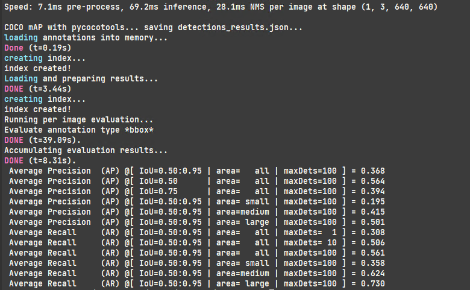

# 模型信息

YOLOv5 是一种在图像检测中广泛使用的深度卷积神经网络，其速度快和检测精度高，是最著名的物体检测算法之一。YOLOv5已有7个衍生版本，每个版本又根据参数两分为n、s、m、l、x五种类型，以下其最新版YOLOv5s-7.0为例。

算法介绍：https://docs.ultralytics.com/yolov5/

开源模型链接：https://github.com/ultralytics/yolov5/releases/tag/v7.0

# 资源准备

1. 1台REX1032服务器(卡满插且卡均正常)。

2. 清微docker镜像：TX8100_REX1032_Release_v4.3.7.p3.tar.gz。

3. Conda环境：opt.miniconda.tar.gz。

4. 模型资源下载(可选)
   软件包中已有resnet50.onnx 模型，数据类型FP16, 可直接使用。
   也可选择下载官网模型。[下载resnet50 onnx权重](https://github.com/onnx/models/raw/refs/heads/main/validated/vision/classification/resnet/model/resnet50-v1-12.onnx?download=)

5. 工具链TxNN软件包：txnn_1.2.1_buildxxx.tar.gz，解压后，与该示例相关的内容如下：

   其中：

    * resnet50文件夹中包含运行resnet50模型相关的模型，数据和脚本。
    * script文件夹中 deploy文件夹为环境部署文件夹，其下install_vllm.sh文件为部署CV模型执行文件；
    * txnn.1.2.1_buildxxx.tar.gz压缩包为推理引擎版本包。

# 资源准备

1) 1台REX1032服务器(卡满插且卡均正常)。
2) 清微docker镜像：TX8100_REX1032_Release_v4.3.7.p3.tar.gz。
3) 模型资源下载(可选)
   软件包中已有resnet50.onnx 模型，数据类型FP16, 可直接使用。
   也可选择下载官网模型。[下载resnet50 onnx权重](https://github.com/onnx/models/raw/refs/heads/main/validated/vision/classification/resnet/model/resnet50-v1-12.onnx?download=)

4) 工具链TxNN软件包：txnn_1.2.0_buildxxx.tar.gz，解压后，与该示例相关的内容如下：

   其中：
    * yolov5s文件夹中包含运行yolov5s模型相关的模型，数据和脚本。
    * script文件夹中 deploy文件夹为环境部署文件夹，其下install_vllm.sh文件为部署CV模型执行文件；
    * txnn.1.2.0_build2025xxx.tar.gz压缩包为推理引擎版本包。

# conda环境准备

1) 使用终端工具ssh登录REX1032服务器
   执行如下命令行：

```shell
# HOST_IP为REX1032服务器IP，用户需替换为实际IP地址数值
ssh -X user@HOST_IP
```

2) 解压压缩包
   解压opt.miniconda.tar.gz
   将opt.miniconda.tar.gz，TX8100_REX1032_Release_v4.3.7.p3.tar.gz放至登录用户指定目录下，如用户根目录(~/，下文中绝对路径/login_home)，并解压：

```shell
cd ~/
tar -xvf opt.miniconda.tar.gz
```

解压后得到miniconda目录。
解压docker镜像压缩包， 执行如下命令行：

```shell
sudo tar -zxf TX8100_REX1032_Release_v4.3.7.p3.tar.gz
```

解压得到文件：

```shell
TX8100_REX1032_Release_v4.3.7.p3.tar
Tsm_driver_4.3.7.P3_x86_64_installer.run
```

3) 加载docker镜像
   执行如下命令行：

```shell
sudo docker load -i TX8100_REX1032_Release_v4.3.7.p3.tar
```

Load完毕可以使用如下命令查看镜像是否load成功：

```shell
sudo docker images
```

4) 创建容器
   执行如下命令创建容器：

```shell
sudo docker run -d --name txnn --ipc=host --privileged -v /dev:/dev -v /tmp:/tmp -v /lib/modules:/lib/modules -v /sys:
/sys -v /login_home/xxx/miniconda/:/opt/miniconda -v /login_home/xxx/txnn_convert:/login_home/xxx/txnn_convert -v
/login_home/xxx/txnn_infer/:/login_home/xxx/txnn_infer/ -w /login_home/xxx/txnn_infer hub.tsingmicro.com/tx8/v4.3.7.p3:
kuiper-rex1032-release
```

> 注意：章节[资源准备](#资源准备)中的压缩包均需要放在/login_home/xxx 目录下，挂载至容器内。

5) 配置环境变量
   在容器内export 环境变量

```shell
sudo docker exec -it txnn /bin/bash

sed -i '$a export PATH="/opt/miniconda/bin:$PATH"' /root/.bashrc
sed -i '$a export LD_PRELOAD=/usr/lib/x86_64-linux-gnu/libffi.so.7' /root/.bashrc
sed -i '$a export LD_LIBRARY_PATH=/usr/lib/x86_64-linux-gnu:$LD_LIBRARY_PATH' /root/.bashrc
sed -i '$a export HOME=/opt/miniconda' /root/.bashrc

source /root/.bashrc

# 首次设置需要用source进入conda，后面切换可以直接 conda activate tx8_txnn
source activate tx8_base

# 切换其他环境
conda activate tx8_txnn
```

此时环境变量即可生效，不同conda环境对应说明如下：

* tx8_base：用于模型训练；
* tx8_txnn：用于模型推理；

# 推理

## 启动device

用户在Host端部署执行环境，执行启动Device
拉起TX8 Device并等待ready，新开会话窗口2，执行如下命令：

```shell
./Tsm_driver_4.3.7.P3_x86_64_installer.run install silicon
```

## 推理环境部署

1) 解压工具链TxNN软件包
   将txnn_1.2.1_buildxxx.tar.gz放至登录用户指定目录下，如用户根目录(~/，下文中绝对路径/login_home)，并解压：

   ```shell
   cd ~/
   tar -xzvf  txnn_1.2.1_buildxxx.tar.gz
   ```

   解压后得到txnn_1.2.1_buildxxx目录。解压后，与该示例相关的内容如下：
   其中：

    - yolov5s文件夹中包含运行yolov5s模型相关的模型，数据和脚本。
    - script文件夹中 deploy文件夹为环境部署文件夹，其下install_vllm.sh文件为部署CV模型执行文件；
    - txnn.1.2.1_buildxxx.tar.gz压缩包为推理引擎版本包。

2) 进入docker容器

   执行如下命令进入容器：

   ```shell
   sudo docker exec -it txnn /bin/bash
   ```

3) 执行环境部署脚本

进入登录用户home目录，带参数执行install_vllm.sh脚本，共需要传入2个参数，分别为：1. HOME_PATH 目录；2. VERSION版本号。
示例如下

```shell
cd $HOME_PATH/txnn_1.2.1_buildxxx/script/deploy
#带参数运行脚本
bash install_vllm.sh /login_home/xxx txnn.1.2.1_buildxxx
```

4) 编译onnx模型生成板端运行文件
   解压script/TxCompiler.1.2.1_buildxxx.tar.gz 工具，直接执行其中的sh命令接口，示例如下：

   ```shell
   4) tar -xzvf TxCompiler.1.2.1_buildxxx.tar.gz
   
   cd TxCompiler
   #将onnx模型作为入参
   bash scripts/TxCompiler.sh ../../resnet50/model/resnet50_fp16.onnx
   bash scripts/TxCompiler.sh ../../yolov5s/model/yolov5s_fp16.onnx
   ```

## 图像分类推理

`yolov5s/plot_image`目录下提供有脚本：plot_image.py，供用户在docker内执行，体验推理功能。
运行示例：在`REX1032`服务器上，推理图片，并绘制检测框。
在会话窗口1执行如下命令，指定`--device`参数选择卡运行，默认0号卡。

```shell
cd $HOME_PATH/txnn_1.2.1_buildxxx/yolov5s/plot_image
python plot_image.py
```

执行成功后可输出画框结果图保存在`./runs/detect`目录下。

## mAP精度评估

yolov5s/eval_coco目录下提供有脚本：eval_yolov5s_coco.py
运行示例：在REX1032服务器，评估coco数据集精度。
在会话窗口1执行如下命令，启动批量数据推理服务，指定--device参数选择卡运行，默认0号卡。

```shell
cd $HOME_PATH/txnn_1.2.0_buildxxx/yolov5s/eval_coco
python eval_yolov5s_coco.py
```

执行成功，输出mAP结果和推理性能结果，界面如下所示：


# 版本说明

2025/3/11 第一版
